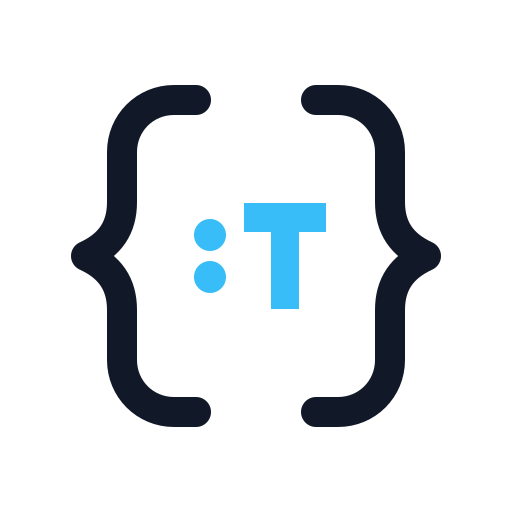

# Typepeek

<p align="center">
  
</p>

Typepeek shows the TypeScript interface of an installed package without importing or executing it. Use it to find exports, inspect signatures and declarations, discover public subpaths, and compare the interfaces visible from two projects.

Typepeek reads the packages already installed for a project. Results match the package version, module conditions, and declarations available to that project. They do not rely on online documentation.

Typepeek requires Node.js 24.18 or later within the Node.js 24 release line. The examples use npm because it ships with Node.js. If you prefer another package manager, use its equivalent install and run commands.

## Run Typepeek

Choose how to run Typepeek.

### Install in a project

For repeatable use, install Typepeek as a development dependency:

```bash
npm install --save-dev typepeek
npx typepeek overview execa --context .
```

`npx` uses the project-local executable when Typepeek is installed.

### Run once

Run the latest release without adding Typepeek to `package.json`:

```bash
npx --yes typepeek@latest overview execa --context .
```

### Install globally

Install one version for direct use across projects:

```bash
npm install --global typepeek
typepeek overview execa --context .
```

A global installation is convenient, but every project shares the installed version.

## Why Typepeek

If your project imports `execa`, Typepeek can read the call signatures for its main export from the installed declarations:

```bash
npx typepeek signatures execa execa --context .
```

Typepeek returns each public call and construct signature in declaration order.

> [!IMPORTANT]
> Set `--context` to the consuming project's directory. Typepeek starts module resolution there, so the context determines which installed package and resolution conditions it sees.

Inspect an installed package from the consuming project:

```bash
npx typepeek overview execa --context .
```

`overview` is the default command, so the final command can also be written as:

```bash
npx typepeek execa --context .
```

Run `npx typepeek --help` for the complete command surface. If you installed Typepeek globally, invoke `typepeek` directly instead.

## Choose an inspection

Start with the narrowest inspection that answers your question.

| Question                                                                                         | Command        |
| ------------------------------------------------------------------------------------------------ | -------------- |
| What does this module export?                                                                    | `overview`     |
| Which export names contain this text?                                                            | `search`       |
| Which public subpaths does this package expose?                                                  | `subpaths`     |
| How can I call or construct this export?                                                         | `signatures`   |
| What declarations define this export?                                                            | `declarations` |
| What defines this exact public member?                                                           | `member`       |
| Which declarations, signatures, supporting types, and package documentation explain this export? | `export`       |
| How can I run several inspections against one evidence snapshot?                                 | `plan`         |
| Which export names or public subpaths differ between two contexts?                               | `compare`      |

For example, discover an export before inspecting it:

```bash
npx typepeek search execa error --context .
npx typepeek declarations execa ExecaError --context .
```

Add `--json` for structured output. Add `--pretty` with `--json` when a person needs to read that output:

```bash
npx typepeek signatures execa execa --context . --json --pretty
```

Commands use the `import` access style by default. Pass `--access require` when you need the interface selected for CommonJS resolution conditions.

## What Typepeek inspects

Typepeek inspects installed package modules, their manifest-declared public subpaths, and linked workspace packages. It also inspects Node.js platform modules when the project can resolve `@types/node`. Typepeek supports ordinary `node_modules` installations produced by npm, pnpm, and Bun.

A requested Package Module need not appear in the Resolution Context's manifest. Typepeek can inspect it when its Specifier resolves through an ancestor `node_modules` directory, including when the installation hoists it for another Package Module. Typepeek does not scan nested `node_modules` directories that the Resolution Context cannot resolve.

Inspection is static. Typepeek reads installed manifests, declarations, package-exposed TypeScript source, and attached JSDoc. It does not import package code, run package scripts, evaluate project configuration code, or download missing material.

Every inspection is bounded. Typepeek returns a complete result or an explicit typed failure when evidence is missing, unsupported, or too large. It does not present a partial result as authoritative.

## Use Typepeek with coding agents

Agents can use CLI JSON or the transport-neutral Inspection Protocol. `capabilities` describes the protocol version, supported intents, request fields, response options, failures, and budget dimensions without inspecting a package:

```bash
npx typepeek capabilities
```

Install the Typepeek agent skill with the [`skills.sh`](https://skills.sh) CLI:

```bash
npx skills@latest add ueberBrot/typepeek --skill typepeek
```

The skill teaches supported coding agents to choose the narrowest useful inspection. It does not install the Typepeek CLI.

Typepeek ships a CLI. Programmatic adapters invoke the `protocol` command over stdin and stdout. Typepeek exposes no JavaScript library and ships no MCP server.

## Development

Typepeek development requires pnpm 11.20. Install the locked dependencies, then run the full validation suite:

```bash
vp install --frozen-lockfile
vp run validate
```

Useful development commands:

```bash
vp run check       # format, lint, and type-check
vp test            # run the test suite
vp build           # build the application bundle
vp pack            # build the publishable package
```
